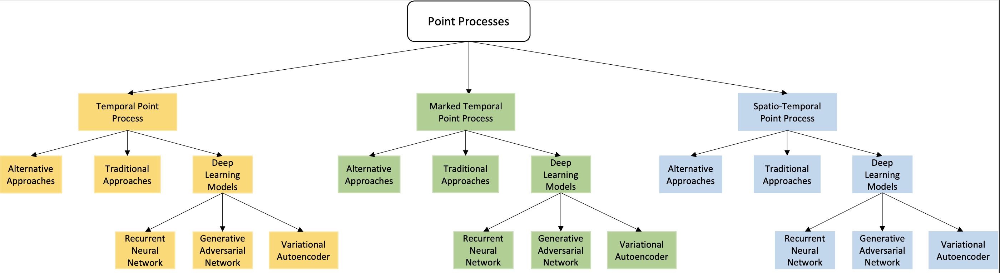

<h1 align="center">
    
</h1>

    <strong>Modeling Events and Interactions through Temporal Processes - A Survey</strong>

A list of Point Processes resources.

    <a href="#methods">Methods</a> •
    <a href="#survey">Survey</a> •
    <a href="#datasets">Datasets</a> •
    <a href="#references">References</a>

# Methods

<table>
<tr>
    <th>Paper</th>
    <th>Date</th>
</tr>

<tr>
<th>Uncertainty-Aware Anticipation of Activities <a href="#references">[Far19]</a> </th>
<th>2019</th>
</tr>

<tr>
<th>A Variational Auto-Encoder Model for Stochastic Point Processes <a href="#references">[Meh19]</a></th>
<th>2019</th>
<th></th>
</tr>

<tr>
<th>Recurrent Marked Temporal Point Processes: Embedding Event History to Vector <a href="#references">[Du16]</a></th>
<th>2016</th>
</tr>

<tr>
<th>When will you do what? - Anticipating Temporal Occurrences of Activity<a href="#references">[Far18]</a></th>
<th>2018</th>
</tr>

<tr>
<th>Predictive Business Process Monitoring via Generative Adversarial Nets: The Case of Next Event Prediction<a href="#references">[Tay20a]</a></th>
<th>2020</th>
</tr>

<tr>
<th>Encoder-Decoder Generative Adversarial Nets for Suffix Generation and Remaining Time Prediction of Business Process Models<a href="#references">[Tay20b]</a></th>
<th>2020</th>
</tr>

<tr>
<th>An empirical comparison of deep-neural-network architectures for next activity prediction using context-enriched process event logs</th>
<th>2020</th>
</tr>

<tr>
<th>What Averages Do Not Tell - Predicting Real Life Processes with Sequential Deep Learning</th>
<th>2021</th>
</tr>

<tr>
<th>A Deep Adversarial Model for Suffix and Remaining Time Prediction of Event Sequences <a href="#references">[Tay21]</a></th>
<th>2021</th>
</tr>

<tr>
<th>What Happens Next? Event Prediction Using a Compositional Neural Network Model</th>
<th>2016</th>
</tr>

<tr>
<th>Attentive Neural Point Processes for Event Forecasting</th>
<th>2021</th>
</tr>

<tr>
<th>Deep Mixture Point Processes: Spatio-temporal Event Prediction with Rich Contextual Information</th>
<th>2019</th>
</tr>

<tr>
<th>Deviation-based Marked Temporal Point process for Marker Prediction <a href="#references">[Ch21]</a></th>
<th>2021</th>
</tr>

<tr>
<th>SEISMIC: A Self-Exciting Point Process Model for Predicting Tweet Popularity </th>
<th>2015</th>
</tr>

<tr>
<th>Uncertainty on Asynchronous Time Event Prediction <a href="#references">[Cha19]</a></th>
<th>2019</th>
</tr>

<tr>
<th>A Variational Point Process Model for Social Event Sequences </th>
<th>2020</th>
</tr>

<tr>
<th>What is More Likely to Happen Next? Video-and-Language Future Event Prediction</th>
<th>2020</th>
</tr>

<tr>
<th>Variational Neural Temporal Point Process <a href="#references">[Eo22]</a></th>
<th>2022</th>
</tr>

<tr>
<th>Future Event Prediction: I f and When</th>
<th>2019</th>
</tr>

<tr>
<th>Wasserstein generative adversarial networks for modeling marked events</th>
<th>2022</th>
</tr>

<tr>
<th>Lecture Notes: Temporal Point Processes and the Conditional Intensity Function</th>
<th>2018</th>
</tr>

<tr>
<th>Deep Reinforcement Learning of Marked Temporal Point Processes</th>
<th>2018</th>
</tr>

<tr>
<th>Learning Temporal Point Processes via Reinforcement Learning</th>
<th>2018</th>
</tr>

<tr>
<th>Wasserstein Learning of Deep Generative Point Process Models</th>
<th>2017</th>
</tr>

<tr>
<th>Learning Mixture of Neural Temporal Point Processes for Multi-dimensional Event Sequence Clustering</th>
<th>2022</th>
</tr>

<tr>
<th>Deep Recurrent Survival Analysis</th>
<th>2019</th>
</tr>

<tr>
<th>Deep Structural Point Process for Learning Temporal Interaction Networks</th>
<th>2021</th>
</tr>

<tr>
<th>Tracing temporal communities and event prediction in dynamic social networks</th>
<th>2019</th>
</tr>

<tr>
<th>A Model-Free Approach to Infer the Diffusion Network from Event Cascade</th>
<th>2016</th>
</tr>

<tr>
<th>Intensity-Free Learning of Temporal Point Processes</th>
<th>2019</th>
</tr>

<tr>
<th>Self-Attentive Hawkes Process</th>
<th>2020</th>
</tr>

<tr>
<th>Neural Spatio-Temporal Point Processes</th>
<th>2021</th>
</tr>

<tr>
<th>Time2Vec: Learning a Vector Representation of Time</th>
<th>2019</th>
</tr>

<tr>
<th>Transformer Hawkes Process</th>
<th>2020</th>
</tr>

<tr>
<th>The Neural Hawkes Process: A Neurally Self-Modulating Multivariate Point Process</th>
<th>2017</th>
</tr>

<tr>
<th>Modeling the Intensity Function of Point Process Via Recurrent Neural Networks</th>
<th>2017</th>
</tr>

<tr>
<th>Neural Survival Recommender</th>
<th>2017</th>
</tr>

<tr>
<th>Learning Time Series Associated Event Sequences With Recurrent Point Process Networks</th>
<th>2019</th>
</tr>

<tr>
<th>DeepDiffuse: Predicting the 'Who' and 'When' in Cascades</th>
<th>2018</th>
</tr>

<tr>
<th>Inf-VAE: A Variational Autoencoder Framework to Integrate Homophily and Influence in Diffusion Prediction</th>
<th>2020</th>
</tr>

<tr>
<th>Exploiting Marked Temporal Point Processes for Predicting Activities of Daily Living</th>
<th>2020</th>
</tr>

<tr>
<th>Modeling Event Propagation via Graph Biased Temporal Point Process</th>
<th>2020</th>
</tr>

<tr>
<th>Learning Neural Point Processes with Latent Graphs</th>
<th>2021</th>
</tr>

<tr>
<th>Information Cascading in Social Networks</th>
<th>2021</th>
</tr>

<tr>
<th>Learning Conditional Generative Models for Temporal Point Processes</th>
<th>2018</th>
</tr>

<tr>
<th>COEVOLVE: A Joint Point Process Model for Information Diffusion and Network Co-evolution</th>
<th>2016</th>
</tr>

<tr>
<th>Topological Recurrent Neural Network for Diffusion Prediction</th>
<th>2017</th>
</tr>

<tr>
<th>Cascade Dynamics Modeling with Attention-based Recurrent Neural Network</th>
<th>2017</th>
</tr>

<tr>
<th>Time-Dependent Representation for Neural Event Sequence Prediction</th>
<th>2018</th>
</tr>

<tr>
<th>Modeling Sequential Online Interactive Behaviors with Temporal Point Process</th>
<th>2018</th>
</tr>

<tr>
<th>Marked Temporal Dynamics Modeling Based on Recurrent Neural Network</th>
<th>2017</th>
</tr>

<tr>
<th>Time Perception Machine: Temporal Point Processes for the When, Where and What of Activity Prediction</th>
<th>2018</th>
</tr>

<tr>
<th>Transformer-Based Deep Survival Analysis</th>
<th>2021</th>
</tr>

<tr>
<th>Imitation Learning of Neural Spatio-Temporal Point Processes</th>
<th>2021</th>
</tr>

<tr>
<th>Calibration and Uncertainty in Neural Time-to-Event Modeling</th>
<th>2020</th>
</tr>

<tr>
<th>Temporal Logic Point Processes</th>
<th>2020</th>
</tr>

<tr>
<th>Recurrent Point Processes for Dynamic Review Models</th>
<th>2020</th>
</tr>

<tr>
<th>How Can Our Tweets Go Viral? Point-Process Modelling of Brand Content</th>
<th>2022</th>
</tr>

<tr>
<th>Modeling Marked Temporal Point Process Using Multi-relation Structure RNN</th>
<th>2019</th>
</tr>

<tr>
<th>Know-Evolve: Deep Temporal Reasoning for Dynamic Knowledge Graphs</th>
<th>2017</th>
</tr>

<tr>
<th>A gan-based framework for modeling hashtag popularity dynamics using assistive information</th>
<th>2020</th>
</tr>

<tr>
<th>Adversarial Time-to-Event Modeling</th>
<th>2018</th>
</tr>

<tr>
<th>Forecasting Future Action Sequences with Neural Memory Networks</th>
<th>2019</th>
</tr>

<tr>
<th>Semi-supervised Learning for Marked Temporal Point Processes</th>
<th>2021</th>
</tr>

<tr>
<th>INITIATOR: Noise-contrastive Estimation for Marked Temporal Point Process</th>
<th>2018</th>
</tr>

<tr>
<th>Modeling Continuous Time Sequences with Intermittent Observations using Marked Temporal Point Processes</th>
<th>2022</th>
</tr>

<tr>
<th>Interpretable Deep Generative Spatio-Temporal Point Processes</th>
<th>2020</th>
</tr>

<tr>
<th>HyperHawkes: Hypernetwork based Neural Temporal Point Process</th>
<th>2022</th>
</tr>

<tr>
<th>Point Process Flows</th>
<th>2019</th>
</tr>

<tr>
<th>ProActive: Self-Attentive Temporal Point Process Flows for Activity Sequences</th>
<th>2022</th>
</tr>

<tr>
<th>Time is of the Essence: A Joint Hierarchical RNN and Point Process Model for Time and Item Predictions</th>
<th>2019</th>
</tr>

<tr>
<th>Geometric Hawkes Processes with Graph Convolutional Recurrent Neural Networks</th>
<th>2019</th>
</tr>

<tr>
<th>Social lstm: Human trajectory prediction in crowded spaces</th>
<th>2016</th>
</tr>

<tr>
<th>Temporally-Consistent Survival Analysis</th>
<th>2022</th>
</tr>

<tr>
<th>Variational Policy for Guiding Point Processes</th>
<th>2017</th>
</tr>

<tr>
<th>Cheshire: An Online Algorithm for Activity Maximization in Social Networks</th>
<th>2017</th>
</tr>

<tr>
<th>Learning and Forecasting Opinion Dynamics in Social Networks</th>
<th>2017</th>
</tr>

<tr>
<th>A Dirichlet Mixture Model of Hawkes Processes for Event Sequence Clustering</th>
<th>2017</th>
</tr>

<tr>
<th>Modeling the Dynamics of Learning Activity on the Web</th>
<th>2017</th>
</tr>

<tr>
<th>Uncovering Causality from Multivariate Hawkes Integrated Cumulants</th>
<th>2018</th>
</tr>

<tr>
<th>Decoupled Learning for Factorial Marked Temporal Point Processes</th>
<th>2018</th>
</tr>

<tr>
<th>Explainable Hyperbolic Temporal Point Process for User-Item Interaction Sequence Generation</th>
<th>2022</th>
</tr>

<tr>
<th>Counterfactual Phenotyping with Censored Time-to-Events</th>
<th>2022</th>
</tr>

<tr>
<th>Continual Learning for Time-to-Event Modeling</th>
<th>2022</th>
</tr>

</table>

# Survey

<table>
<tr>
    <th>Paper</th>
    <th>Date</th>
</tr>

<tr>
<th>Neural Temporal Point Process: A Review<a href="#references">[]</a> </th>
<th>2021</th>
</tr>

<tr>
<th>Recent Advance in Temporal Point Process: from Machine Learning Perspective<a href="#references">[]</a> </th>
<th>2019</th>
</tr>

<tr>
<th>Machine Learning for Survival Analysis: A Survey<a href="#references">[]</a> </th>
<th>2019</th>
</tr>

<tr>
<th>Influence Maximization on Social Graphs: A Survey<a href="#references">[]</a> </th>
<th>2018</th>
</tr>

<tr>
<th>Deep Learning for Social Network Information Cascade Analysis: a survey<a href="#references">[]</a> </th>
<th>2020</th>
</tr>

<tr>
<th>Spatio-temporal point process statistics: A review<a href="#references">[]</a> </th>
<th>2016</th>
</tr>

<tr>
<th>Event Prediction in the Big Data Era: A Systematic Survey<a href="#references">[]</a> </th>
<th>2022</th>
</tr>

<tr>
<th>Real-world diffusion dynamics based on point process approaches: a review<a href="#references">[]</a> </th>
<th>2020</th>
</tr>

</table>

# Datasets

A list of the relevant datasets is available <a href="https://github.com/Angielica/datasets_point_processes">here</a>.

# References

- <a href=""> [Cha19] </a> B Charpentier,
               M. Bilos,
               S, Gunnemann. Uncertainty on Asynchronous Time Event Prediction. Advances in Neural Information Processing Systems 32: Annual Conference
               on Neural Information Processing Systems 2019, NeurIPS 2019

- <a href="https://2021.ecmlpkdd.org/wp-content/uploads/2021/07/sub_40.pdf"> [Ch21]</a> A. V. S. Chauhan, S. Reddy, M. Singh, K. Singh, T. Bhowmik. Deviation-based Marked Temporal Point process for Marker Prediction. (2021).

- <a href="https://openaccess.thecvf.com/content_ICCVW_2019/papers/HBU/Abu_Farha_Uncertainty-Aware_Anticipation_of_Activities_ICCVW_2019_paper.pdf"> [Du16]</a> N. Du, H. Dai, R. Trivedi, U. Upadhyay, M. Gomez-Rodriguez, L. Song. Recurrent Marked Temporal Point Processes: Embedding event history to vector. Proceedings of the 22nd ACM SIGKDD International Conference on Knowledge Discovery and Data Mining. (2016) 

- <a href="https://arxiv.org/pdf/2202.10585.pdf"> [Eo22]</a> D. Eom, S. Lee, J. Choi. Variational Neural Temporal Point Process. (2022).

- <a href="https://openaccess.thecvf.com/content_ICCVW_2019/papers/HBU/Abu_Farha_Uncertainty-Aware_Anticipation_of_Activities_ICCVW_2019_paper.pdf"> [Far19]</a> Y. A. Farha, J. Gall. Uncertainty-Aware Anticipation of Activities. (2019).

- <a href="https://arxiv.org/pdf/1804.00892.pdf"> [Far18] </a> Y. A. Farha, A. Richard, J. Gall. When Will You Do What? - Anticipating Temporal Occurrences of Activities. IEEE Conference on Computer Vision and Pattern Recognition,
               CVPR (2018)

- <a href=""> [Gra16] </a>  M. Granroth-Wilding,
               S. Clark. What Happens Next? Event Prediction Using a Compositional Neural Network
               Model. Proceedings of the Thirtieth {AAAI} Conference on Artificial Intelligence (2016)

- <a href=""> [Gu21] </a> Y. Gu. Attentive Neural Point Processes for Event Forecasting. Thirty-Fifth {AAAI} Conference on Artificial Intelligence, {AAAI}
               (2021)

- <a href="https://dl.acm.org/doi/abs/10.1145/3477314.3507179"> [Ket22] </a> I. Ketykó, F. Mannhardt, M. Hassani, B. F. van Dongen. What averages do not tell: predicting real life processes with sequential
               deep learning. SAC '22: The 37th ACM/SIGAPP Symposium on Applied Computing (2022).

- <a href="https://arxiv.org/pdf/1904.03273.pdf"> [Meh19]</a> N. Mehrasa, A. A. Jyothi, T. Durand, J. He, L. Sigal, G. Mori. A Variational Auto-Encoder Model for Stochastic Point Processes. (2019).

- <a href=""> [Oka19]</a> M. Okawa,
               T. Iwata,
               T. Kurashima,
               Y. Tanaka,
               H. Toda,
               N. Ueda. Deep Mixture Point Processes: Spatio-temporal Event Prediction with
               Rich Contextual Information. Proceedings of the 25th ACM SIGKDD International Conference on
               Knowledge Discovery and Data Mining (2019)

- <a href="https://arxiv.org/pdf/2102.07298.pdf"> [Tay21]</a> F. Taymouri, M. La Rosa, S. M. Erfani. A Deep Adversarial Model for Suffix and Remaining Time Prediction of Event Sequences. Proceedings of the 2021 SIAM International Conference on Data Mining (2021).

- <a href="https://link.springer.com/chapter/10.1007/978-3-030-58666-9_14"> [Tay20a] </a> F. Taymouri, M. La Rosa, S. M. Erfani, Z. D. Bozorgi, I. Verenich. Predictive Business Process Monitoring via Generative Adversarial Nets: The Case of Next Event Prediction. Business Process Management - 18th International Conference (2020)

- <a href="https://arxiv.org/pdf/2007.16030.pdf"> [Tay20b] </a> F. Taymouri, M. La Rosa. Encoder-Decoder Generative Adversarial Nets for Suffix Generation and Remaining Time Predication of Business Process Models. (2020)

- <a href="https://arxiv.org/abs/2005.01194"> [Wei20] </a> S. Weinzierl, S. Zilker, J. Brunk, K. Revoredo, A. Nguyen, M. Matzner, J. Becker, B. M. Eskofier. An empirical comparison of deep-neural-network architectures for next activity prediction using context-enriched process event logs. (2020)

- <a href=""> [Zha15] </a> Q. Zhao,
               M. A. Erdogdu,
               H. Y. He,
               A. Rajaraman,
               J. Leskovec. SEISMIC: A Self-Exciting Point Process Model for Predicting Tweet
               Popularity. Proceedings of the 21th ACM SIGKDD International Conference on
               Knowledge Discovery and Data Mining (2015)

- <a href=""> [Pan20] </a> Z. Pan,
               Z. Huang,
               D. Lian,
               E. Chen. A Variational Point Process Model for Social Event Sequences. The Thirty-Fourth {AAAI} Conference on Artificial Intelligence, {AAAI}
               2020 (2020)

- <a href=""> [Lei20] </a> J. Lei,
               L. Yu,
               T. L. Berg,
               M. Bansal. What is More Likely to Happen Next? Video-and-Language Future Event
               Prediction. Proceedings of the 2020 Conference on Empirical Methods in Natural
               Language Processing, {EMNLP} 2020 (2020)

- <a href=""> [Eom22] </a> D. Eom,
               S. Lee,
               J. Choi. Variational Neural Temporal Point Process (2022)

- <a href=""> [Neu19] </a> L. Neumann,
               A. Zisserman,
               A. Vedaldi. Future Event Prediction: If and When. {IEEE} Conference on Computer Vision and Pattern Recognition Workshops,
               {CVPR} Workshops 2019 (2019)

- <a href=""> [Diz22] </a> S.H.S. Dizaji, S. Pashazadeh, J.M. Niya. Wasserstein generative adversarial networks for modeling marked events. The Journal of Supercomputing. (2022)

- <a href=""> [Shc21] </a> O. Shchur,
               A. C. Turkmen,
               T. Januschowski,
               S. Gunnemann. Neural Temporal Point Processes: A Review. Proceedings of the Thirtieth International Joint Conference on Artificial
               Intelligence, {IJCAI} 2021 (2021)

- <a href=""> [Yan19] </a> J. Yan. Recent Advance in Temporal Point Process : from Machine Learning Perspective (2019)

- <a href=""> [Ras18] </a> J. G. Rasmussen. Lecture Notes: Temporal Point Processes and the Conditional Intensity Function (2018)

- <a href=""> [Upa18] </a> U. Upadhyay,
               A. De,
               M. G. Rodriguez. Deep Reinforcement Learning of Marked Temporal Point Processes.
              Advances in Neural Information Processing Systems 31: Annual Conference
               on Neural Information Processing Systems 2018, NeurIPS 2018 (2018)

- <a href=""> [Li18] </a> S. Li,
               Shuai Xiao,
               Shixiang Zhu,
               Nan Du,
               Yao Xie,
               Le Song. Learning Temporal Point Processes via Reinforcement Learning. Advances in Neural Information Processing Systems 31: Annual Conference
               on Neural Information Processing Systems 2018, NeurIPS 2018. (2018)

- <a href=""> [Xia17] </a> Shuai Xiao and
               Mehrdad Farajtabar and
               Xiaojing Ye and
               Junchi Yan and
               Xiaokang Yang and
               Le Song and
               Hongyuan Zha. Wasserstein Learning of Deep Generative Point Process Models. Advances in Neural Information Processing Systems 30: Annual Conference
               on Neural Information Processing Systems 2017. (2017)

- <a href=""> [Zha22] </a> Yunhao Zhang and
               Junchi Yan and
               Xiaolu Zhang and
               Jun Zhou and
               Xiaokang Yang. Learning Mixture of Neural Temporal Point Processes for Multi-dimensional
               Event Sequence Clustering. Proceedings of the Thirty-First International Joint Conference on
               Artificial Intelligence, {IJCAI} 2022 (2022)

- <a href=""> [Wan19] </a>  Ping Wang and
               Yan Li and
               Chandan K. Reddy. Machine Learning for Survival Analysis: {A} Survey. {ACM} Comput. Surv. (2019)

- <a href=""> [Ren19] </a> Kan Ren and
               Jiarui Qin and
               Lei Zheng and
               Zhengyu Yang and
               Weinan Zhang and
               Lin Qiu and
               Yong Yu. Deep Recurrent Survival Analysis. The Thirty-Third {AAAI} Conference on Artificial Intelligence, {AAAI}
               2019 (2019)

- <a href=""> [Cao21] </a> Jiangxia Cao and
               Xixun Lin and
               Xin Cong and
               Shu Guo and
               Hengzhu Tang and
               Tingwen Liu and
               Bin Wang. Deep Structural Point Process for Learning Temporal Interaction Networks. Machine Learning and Knowledge Discovery in Databases. Research Track
               - European Conference, {ECML} {PKDD} 2021 (2021)

- <a href=""> [Kha19] </a> Taleb Khafaei and
               Alireza Tavakoli Targhi and
               Mehdi Hosseinzadeh and
               Ali Rezaee. Tracing temporal communities and event prediction in dynamic social
               networks. Soc. Netw. Anal. Min. (2019)

- <a href=""> [Ron16] </a> Y. Rong and
               Qiankun Zhu and
               Hong Cheng. A Model-Free Approach to Infer the Diffusion Network from Event Cascade. Proceedings of the 25th {ACM} International Conference on Information
               and Knowledge Management, {CIKM} 2016 (2016) 

- <a href=""> [Li18] </a> Yuchen Li and
               Ju Fan and
               Yanhao Wang and
               Kian{-}Lee Tan. Influence Maximization on Social Graphs: {A} Survey. {IEEE} Trans. Knowl. Data Eng. (2018)

- <a href=""> [Shc20] </a> Oleksandr Shchur and
               Marin Bilos and
               Stephan G{\"{u}}nnemann. Intensity-Free Learning of Temporal Point Processes. 8th International Conference on Learning Representations, {ICLR} 2020 (2020)

- <a href=""> [Zha20] </a> Qiang Zhang and
               Aldo Lipani and
               {\"{O}}mer Kirnap and
               Emine Yilmaz. Self-Attentive Hawkes Process. Proceedings of the 37th International Conference on Machine Learning,
               {ICML} 2020 (2020)

- <a href=""> [Che21] </a> Ricky T. Q. Chen and
               Brandon Amos and
               Maximilian Nickel. Neural Spatio-Temporal Point Processes. 9th International Conference on Learning Representations, {ICLR} 2021 (2021)

- <a href=""> [Kaz19] </a> Seyed Mehran Kazemi and
               Rishab Goel and
               Sepehr Eghbali and
               Janahan Ramanan and
               Jaspreet Sahota and
               Sanjay Thakur and
               Stella Wu and
               Cathal Smyth and
               Pascal Poupart and
               Marcus A. Brubake. Time2Vec: Learning a Vector Representation of Time. (2019)

- <a href=""> [Zuo20] </a> Simiao Zuo and
               Haoming Jiang and
               Zichong Li and
               Tuo Zhao and
               Hongyuan Zha. Transformer Hawkes Process. Proceedings of the 37th International Conference on Machine Learning,
               {ICML} 2020 (2020)

- <a href=""> [Mei17] </a> Hongyuan Mei and
               Jason Eisner. The Neural Hawkes Process: {A} Neurally Self-Modulating Multivariate
               Point Process. Advances in Neural Information Processing Systems 30: Annual Conference
               on Neural Information Processing Systems 2017. (2017)

- <a href=""> [Xia17] </a> Shuai Xiao and
               Junchi Yan and
               Xiaokang Yang and
               Hongyuan Zha and
               Stephen M. Chu. Modeling the Intensity Function of Point Process Via Recurrent Neural
               Networks. Proceedings of the Thirty-First {AAAI} Conference on Artificial Intelligence. (2017)

- <a href=""> [Jin17] </a> How Jing and
               Alexander J. Smola. Neural Survival Recommender. Proceedings of the Tenth {ACM} International Conference on Web Search
               and Data Mining, {WSDM} 2017. (2017)
- <a href=""> [Xia19] </a> Shuai Xiao and
               Junchi Yan and
               Mehrdad Farajtabar and
               Le Song and
               Xiaokang Yang and
               Hongyuan Zha.
